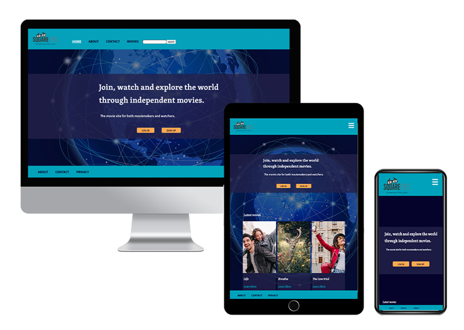

# Square Eyes Movie Site



Square Eyes is an independent movie site for both producers and watchers. 
The target audience for people aged 25-40 and who loves cinemas. 

The website is a cross-course project I have been working on from the beginning of my learning progress at Noroff. 
In this project I've worked with UI-design, UX-design and the code. 

## Built With

- [Javascript](https://www.javascript.com/)

## Visit the site

- [Square Eyes](https://distracted-aryabhata-df16ef.netlify.app/)

## Getting Started

### Installing

1. Clone the repo:

```bash
git clone git@github.com:NoroffFEU/portfolio-1-example.git
```

2. Install the dependencies:

```
npm install
```

### Running

To run the app, run the following commands:

```bash
npm run start
```

## Contact

- [My LinkedIn page](https://www.linkedin.com/in/maleneivyolsen/)

- [Discord](https://www.discordapp.com/users/2217)


## License

This project is licensed under the Creative Commons license.
